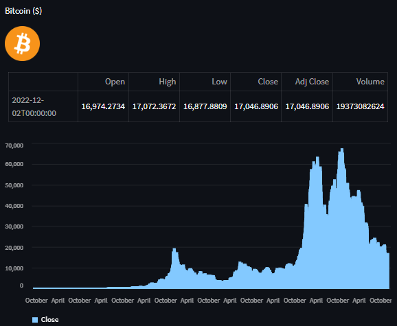
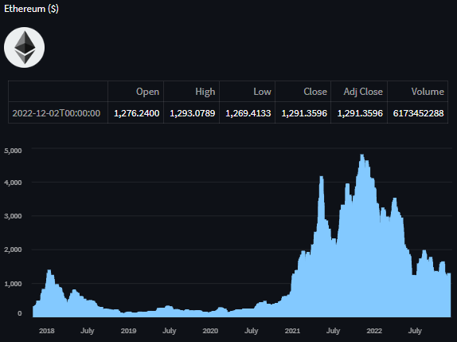
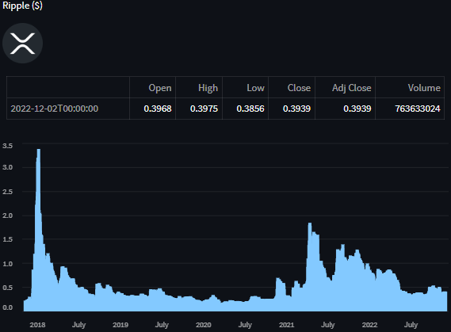
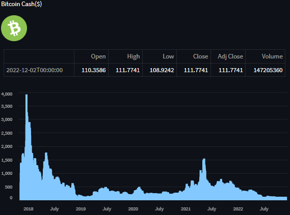

# Cryptocurrency Dashboard

This project showcases a simple cryptocurrency dashboard.

Cryptocurrency used in this platform:
- Bitcoin (BTC)
- Ethereum (ETH)
- Ripple (XRP)
- Bitcoin Cash (BCH)

---

# Libraries Used:
**Streamlit -**
Streamlit lets you turn data scripts into shareable web apps in minutes. It’s all Python, open-source

**Yahoo finance -**
yfinance offers a threaded and Pythonic way to download market data from Yahoo!

**PIL**
PIL is a Python Imaging Library

**urllib**
urllib is a powerful, user-friendly HTTP client for Python.

This platform gives you access to the most recent daily open, high, low, close, adjusted close and volume price as well as a visual dipiction in the form of a barchart. 

---

### Bitcoin

### Ethereum

### Ripple

### Bitcoin Cash

